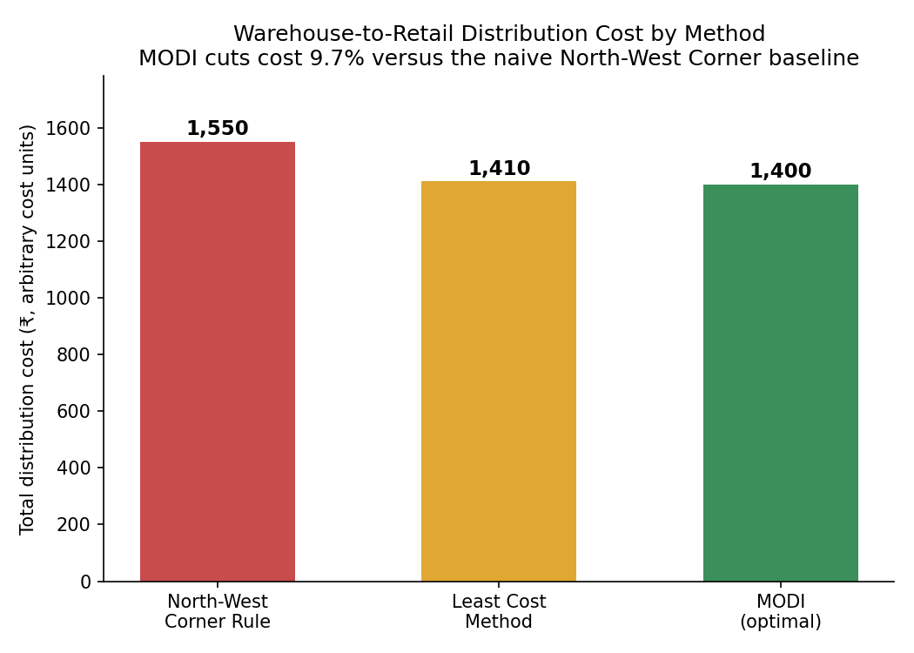

# Warehouse-to-Retail Distribution Cost Optimizer

A from-scratch implementation of the classical **transportation problem** for optimizing warehouse-to-retail distribution decisions.

The project determines how much product should be shipped from each warehouse to each retail market while satisfying supply and demand constraints and minimizing total distribution cost.

Beyond the core optimization algorithm, the project includes:

- Multiple transportation heuristics
- MODI-based optimization
- Degeneracy handling
- Independent LP validation
- Route-level sensitivity analysis
- Warehouse capacity sensitivity
- What-if scenario analysis
- Automatic balancing of unbalanced networks
- 22 automated tests

The solver is written generically so that any cost matrix, supply vector, and demand vector can be supplied. Although the worked example uses warehouses and retail markets, the same formulation applies to plant-to-DC allocation, supplier selection, DC-to-store replenishment, and other supply-demand allocation problems.

---

## Why this problem matters

Distribution cost directly affects landed cost, margins, and retail competitiveness.

A fundamental network-design question is:

> **Which warehouse should serve which market, and how much should each warehouse ship?**

Poor allocation can result in unnecessary transportation costs even when total supply and demand are satisfied.

This project models that decision as a classical transportation optimization problem and finds the minimum-cost shipment plan subject to supply and demand constraints.

The model can also be used to investigate operational risks such as:

- Warehouse capacity reductions
- Demand increases
- Transportation-cost changes
- Warehouse closures
- External sourcing requirements

This moves the project beyond simply finding an optimal allocation toward **evaluating distribution-network resilience and cost sensitivity**.

---

# Problem statement

Given:

- `m` supply sources such as warehouses
- `n` demand destinations such as retail markets
- `supply[i]` representing the capacity of source `i`
- `demand[j]` representing the requirement of destination `j`
- `cost[i][j]` representing the per-unit transportation cost from source `i` to destination `j`

Find shipment quantities:

\[
x_{ij} \geq 0
\]

that minimize:

\[
\min \sum_{i=1}^{m}\sum_{j=1}^{n} c_{ij}x_{ij}
\]

subject to:

### Supply constraints

\[
\sum_{j=1}^{n}x_{ij}=s_i
\]

### Demand constraints

\[
\sum_{i=1}^{m}x_{ij}=d_j
\]

For a balanced transportation problem:

\[
\sum_i s_i = \sum_j d_j
\]

For an unbalanced network, the project can automatically introduce a dummy source or destination to balance the problem.

---

# Worked example

The repository uses the following 3-warehouse × 5-market network.

| | Market 1 | Market 2 | Market 3 | Market 4 | Market 5 | Supply |
|---|---:|---:|---:|---:|---:|---:|
| **Warehouse 1** | 4 | 1 | 2 | 6 | 9 | 100 |
| **Warehouse 2** | 6 | 4 | 3 | 5 | 7 | 120 |
| **Warehouse 3** | 5 | 2 | 6 | 4 | 8 | 120 |
| **Demand** | 40 | 50 | 70 | 90 | 90 | **340** |

**Total supply = 340 units**

**Total demand = 340 units**

Therefore, the base problem is balanced.

---

# Optimization workflow

```text
Input
  │
  ├── Cost Matrix
  ├── Supply
  └── Demand
        │
        ▼
  Balance Problem
        │
        ▼
  Initial Feasible Solution
        │
        ├── North-West Corner Rule
        └── Least Cost Method
                │
                ▼
          MODI Optimization
                │
          ┌─────┴─────┐
          │           │
          ▼           ▼
    Degeneracy     Optimality
     Handling        Check
          │           │
          └─────┬─────┘
                ▼
        Optimal Allocation
                │
        ┌───────┴────────┐
        ▼                ▼
   LP Validation    Sensitivity Analysis
                          │
                          ▼
                   Scenario Analysis
# Methods Used

The project combines classical Operations Research techniques with independent validation and business-oriented analysis.

| Method | Purpose |
|---|---|
| **North-West Corner Rule (NWCR)** | Generates an initial feasible transportation solution |
| **Least Cost Method (LCM)** | Generates a cost-efficient initial feasible solution |
| **MODI (u-v) Method** | Iteratively improves the solution until the minimum-cost allocation is reached |
| **Degeneracy Handling** | Maintains a valid transportation basis when fewer than `m+n-1` positive allocations exist |
| **LP Validation** | Independently validates the custom solver using Linear Programming |
| **Sensitivity Analysis** | Evaluates route-level and warehouse-capacity sensitivity |
| **Scenario Analysis** | Quantifies the impact of operational and network changes |
| **Automatic Balancing** | Handles cases where total supply and demand are unequal |

---

# Optimization Results

For the worked example, the three approaches produce the following transportation costs:

| Method | Transportation Cost |
|---|---:|
| North-West Corner Rule | ₹1,550 |
| Least Cost Method | ₹1,410 |
| MODI Optimized Solution | **₹1,400** |

The MODI method improves upon both initial feasible solutions and reaches the minimum-cost allocation.

### Cost improvement

Compared with the North-West Corner Rule:

\[
\text{Cost Reduction}
=
\frac{1550-1400}{1550}\times100
\]

\[
\boxed{9.68\%}
\]

This demonstrates how optimization can reduce distribution cost even when supply and demand constraints remain unchanged.

The custom MODI implementation was initialized from both NWCR and LCM solutions. Both starting points converged to the same optimal cost of **₹1,400**, providing an additional path-independence check.

---

# Optimal Allocation

The final shipment plan obtained by the MODI optimizer is:

| | Market 1 | Market 2 | Market 3 | Market 4 | Market 5 | Supply |
|---|---:|---:|---:|---:|---:|---:|
| **Warehouse 1** | 10 | 50 | 40 | 0 | 0 | 100 |
| **Warehouse 2** | 0 | 0 | 30 | 0 | 90 | 120 |
| **Warehouse 3** | 30 | 0 | 0 | 90 | 0 | 120 |
| **Demand** | 40 | 50 | 70 | 90 | 90 | 340 |

### Route interpretation

The optimizer concentrates shipments on lower-cost warehouse-market combinations:

- Warehouse 1 serves Market 2 heavily because of its low unit cost.
- Warehouse 1 also supplies part of Market 3.
- Warehouse 2 primarily serves Markets 3 and 5.
- Warehouse 3 primarily serves Markets 1 and 4.

The allocation satisfies all warehouse supply and market demand constraints.

### Optimal cost calculation

\[
10(4)+50(1)+40(2)+30(3)+90(7)+30(5)+90(4)
\]

\[
=40+50+80+90+630+150+360
\]

\[
\boxed{₹1,400}
\]

---

# Cost Comparison

The repository includes `cost_comparison.png`, which compares the transportation cost obtained from the different solution methods.

The visualization highlights the improvement obtained by moving from heuristic initial solutions to the optimized MODI solution.



---

# Sensitivity Analysis

Finding an optimal allocation is only one part of a supply-chain decision.

The project also analyzes how sensitive the network is to changes in:

- Warehouse capacity
- Route competitiveness
- Transportation costs
- Alternative optimal routes

The sensitivity module uses the **MODI dual values (`u`, `v`) and reduced costs** to interpret the current transportation network.

---

## Warehouse Capacity Sensitivity

The MODI method produces warehouse-side dual values that indicate the marginal value of additional capacity under the current basis.

For the base network:

| Warehouse | Dual Value |
|---|---:|
| Warehouse 1 | 0 |
| Warehouse 2 | 1 |
| Warehouse 3 | 1 |

These values are interpreted as **marginal dual values under the current basis**, rather than unconditional savings for every additional unit of capacity.

The analysis helps identify warehouses where capacity changes may have greater influence on the optimized network.

---

# Route-Level Sensitivity

For routes that are not currently used, the project calculates their reduced costs.

A reduced cost of zero indicates that a currently unused route can participate in an alternative optimal solution.

### Alternate-optimal route

The base network identifies:

**Warehouse 3 → Market 2**

as an alternate-optimal route because its reduced cost is zero.

An alternative optimal allocation is:

| | Market 1 | Market 2 | Market 3 | Market 4 | Market 5 |
|---|---:|---:|---:|---:|---:|
| **Warehouse 1** | 40 | 20 | 40 | 0 | 0 |
| **Warehouse 2** | 0 | 0 | 30 | 0 | 90 |
| **Warehouse 3** | 0 | 30 | 0 | 90 | 0 |

This allocation also produces:

\[
\boxed{₹1,400}
\]

Therefore, the network has more than one optimal shipment configuration.

---

## Most Competitive Unused Routes

Other unused routes with relatively low positive reduced costs include:

| Route | Transportation Cost | Reduced Cost |
|---|---:|---:|
| Warehouse 2 → Market 1 | 6 | 1 |
| Warehouse 2 → Market 4 | 5 | 1 |
| Warehouse 3 → Market 5 | 8 | 1 |

These routes are the closest unused routes to becoming competitive under the current optimal basis.

A low positive reduced cost should not automatically be interpreted as a guaranteed alternative optimum; it indicates that the route is relatively close to entering the current optimal basis.

---

# Scenario Analysis

The project includes a what-if analysis module for evaluating changes in the distribution network.

The following scenarios are evaluated against the base optimal cost of **₹1,400**.

| Scenario | Total Scenario Cost | Cost Change | % Change |
|---|---:|---:|---:|
| Base Network | ₹1,400 | — | — |
| Warehouse 2 capacity reduced by 20% | ₹1,448 | +₹48 | +3.43% |
| Market 5 demand increased by 20% | ₹1,562 | +₹162 | +11.57% |
| Warehouse 1 → Market 3 cost increased by 30% | ₹1,424 | +₹24 | +1.71% |
| Warehouse 3 temporarily closed | ₹1,790 | +₹390 | +27.86% |

---

## Scenario 1 — Warehouse 2 Capacity Reduction

Warehouse 2 capacity is reduced by 20%.

The scenario results in:

- Transportation cost: **₹1,232**
- External sourcing: **24 units**
- External sourcing cost: **₹216**
- Total scenario cost: **₹1,448**
- Cost increase: **₹48 (3.43%)**

This demonstrates how a warehouse capacity constraint can force part of the demand to be fulfilled through external sourcing.

---

## Scenario 2 — Market 5 Demand Increase

Market 5 demand is increased by 20%.

Results:

- Transportation cost: **₹1,400**
- External sourcing: **18 units**
- External sourcing cost: **₹162**
- Total scenario cost: **₹1,562**
- Cost increase: **₹162 (11.57%)**

This scenario highlights the effect of demand growth when the existing network does not have sufficient total supply capacity.

---

## Scenario 3 — Transportation Cost Increase

The transportation cost on the route:

**Warehouse 1 → Market 3**

is increased by 30%.

Results:

- Total scenario cost: **₹1,424**
- Cost increase: **₹24**
- Percentage increase: **1.71%**

The optimizer can adjust the shipment allocation in response to changing route economics.

---

## Scenario 4 — Warehouse 3 Closure

Warehouse 3 is temporarily removed from the network.

Results:

- Transportation cost: **₹710**
- External sourcing: **120 units**
- External sourcing cost: **₹1,080**
- Total scenario cost: **₹1,790**
- Cost increase: **₹390 (27.86%)**

This is the most expensive scenario tested.

The result demonstrates that Warehouse 3 plays an important role in the current network and that its temporary closure creates a significant external sourcing requirement.

---

# External Sourcing Assumption

When total demand exceeds available internal supply, the solver can introduce a **dummy source** representing external sourcing or an unmet-demand mechanism.

For the demonstration scenarios, an external sourcing penalty of:

\[
\boxed{₹9\text{ per unit}}
\]

is used.

This value is a **configurable modelling assumption for the example**, not a claim about an actual market sourcing rate.

The scenario engine separates:

\[
\text{Total Scenario Cost}
=
\text{Internal Transportation Cost}
+
\text{External Sourcing Cost}
\]

This allows the impact of supply shortages to be made explicit rather than silently treating missing supply as free.

---

# Unbalanced Network Handling

Real-world supply and demand networks are not always perfectly balanced.

The project therefore includes automatic balancing.

### Excess Supply

If:

\[
\sum Supply > \sum Demand
\]

the solver introduces a **dummy destination** representing unused capacity.

### Excess Demand

If:

\[
\sum Demand > \sum Supply
\]

the solver introduces a **dummy source** representing external sourcing or the supply gap.

The balancing mechanism allows the same transportation optimization engine to operate on both balanced and unbalanced networks.

---

# Independent LP Validation

The custom transportation solver is independently validated using Linear Programming.

Two validation approaches are included:

### SciPy

`validate_scipy.py` formulates the transportation problem using `scipy.optimize.linprog`.

### PuLP

`pulp_validation.py` formulates the same problem as a Linear Programming model and solves it using PuLP/CBC.

Both independently confirm the expected optimal transportation cost:

\[
\boxed{₹1,400}
\]

This provides an external cross-check against the from-scratch MODI implementation rather than relying only on the solver's own output.

---

# Automated Testing

The repository contains automated tests covering the major components of the optimization engine.

The test suite currently contains:

\[
\boxed{22\text{ tests}}
\]

Tests cover:

- North-West Corner Rule
- Least Cost Method
- MODI optimization
- Degenerate transportation problems
- Basis completion
- Dual value calculations
- Reduced costs
- Sensitivity analysis
- Alternate-optimal routes
- Warehouse capacity scenarios
- Demand scenarios
- Route cost scenarios
- Warehouse closure scenarios
- External sourcing calculations
- Balanced networks
- Unbalanced networks
- Dummy source creation
- Dummy destination creation
- Scenario cost consistency

Run the complete test suite with:

```bash
pytest
Expected result:

22 passed
Repository Structure
warehousetoretaildistribution_cost_optimizer/
│
├── transportation_solver.py
│   └── Core transportation optimization engine
│
├── sensitivity_analysis.py
│   └── Route and warehouse sensitivity analysis
│
├── scenario_analysis.py
│   └── What-if scenario analysis
│
├── run_solution.py
│   └── Runs the main optimization workflow
│
├── run_scenarios.py
│   └── Demonstrates network scenarios
│
├── validate_scipy.py
│   └── Independent LP validation using SciPy
│
├── pulp_validation.py
│   └── Independent LP validation using PuLP/CBC
│
├── make_chart.py
│   └── Generates cost comparison visualization
│
├── cost_comparison.png
│   └── Optimization cost comparison chart
│
├── tests/
│   ├── test_solver.py
│   ├── test_degeneracy.py
│   ├── test_sensitivity.py
│   ├── test_scenarios.py
│   └── test_balancing.py
│
├── requirements.txt
├── .gitignore
└── README.md
How to Run
1. Clone the repository
git clone https://github.com/darshika2911/warehousetoretaildistribution_cost_optimizer.git
cd warehousetoretaildistribution_cost_optimizer
2. Install dependencies
pip install -r requirements.txt
3. Run the main optimization
python run_solution.py

This runs the initial feasible solution methods and MODI optimization.

4. Run sensitivity analysis
python sensitivity_analysis.py

This generates the warehouse and route sensitivity report.

5. Run scenario analysis
python run_scenarios.py

This evaluates the example operational scenarios.

6. Run LP validation

Using SciPy:

python validate_scipy.py

Using PuLP:

python pulp_validation.py
7. Run automated tests
pytest
Using a Different Dataset

The solver is designed to be generic.

To solve another transportation network, provide:

cost = [
    [...],
    [...],
    [...]
]

supply = [...]

demand = [...]

For example:

cost = [
    [4, 1, 2],
    [6, 4, 3],
    [5, 2, 6]
]

supply = [100, 120, 120]

demand = [80, 100, 160]

The same optimization engine can then be used without changing the underlying MODI implementation.

Potential applications include:

Warehouse → Retail Store allocation
Plant → Distribution Center allocation
Supplier → Manufacturing Plant allocation
Distribution Center → Store replenishment
Multi-source procurement
Regional distribution planning
Emergency supply allocation
Key Project Outcomes

This project demonstrates the complete workflow of converting a supply-chain allocation problem into an optimization and decision-support system.

Technical outcomes
Implemented the classical transportation problem from scratch
Implemented NWCR and Least Cost Method
Implemented MODI optimization
Added explicit basis management for degeneracy
Implemented automatic balancing of unbalanced networks
Added reduced-cost and dual-value analysis
Independently validated results using LP solvers
Built automated tests for core and edge cases
Supply-chain outcomes
Identified a minimum-cost distribution plan
Achieved 9.68% cost reduction versus the NWCR starting solution
Identified alternate-optimal routes
Evaluated warehouse capacity sensitivity
Quantified demand-growth impact
Evaluated route-cost changes
Quantified the impact of warehouse closure
Incorporated external sourcing into scenario costs
Decision-support perspective

The project moves from:

"Find the cheapest allocation"

to:

"Understand the optimal network,
identify sensitive routes and capacities,
and evaluate how the network behaves under operational changes."
Future Enhancements

Potential extensions include:

Multiple transportation modes
Fixed warehouse operating costs
Vehicle capacity constraints
Maximum route capacities
Lead-time constraints
Service-level constraints
Multi-period inventory planning
Carbon-emission optimization
Transportation-mode selection
Interactive dashboard using Power BI or Streamlit
Historical demand forecasting
Stochastic / robust optimization under demand uncertainty
Visualization of warehouse-to-market shipment flows
Automated scenario comparison dashboard
Limitations

The current implementation focuses on the classical transportation problem.

It assumes:

Linear transportation costs
Known supply and demand
No fixed route-opening costs
No vehicle-level constraints
No explicit inventory holding costs
No lead-time constraints
No uncertainty in demand or supply
A single planning period

Therefore, the model should be viewed as a decision-support prototype, not a complete production-grade supply-chain planning system.

Project Takeaway

The core idea behind the project is simple:

The cheapest-looking individual routes do not necessarily produce the cheapest overall distribution network.

Transportation optimization evaluates the network globally while respecting supply and demand constraints.

By combining:

Optimization + Sensitivity Analysis + Scenario Analysis + Independent Validation

the project provides a more complete framework for evaluating warehouse-to-retail distribution decisions.

Disclaimer

This project is an educational and portfolio implementation of classical transportation optimization techniques.

The transportation costs, supply values, demand values, and external sourcing penalty used in the demonstration are illustrative and should not be interpreted as real commercial rates or operational recommendations.                   